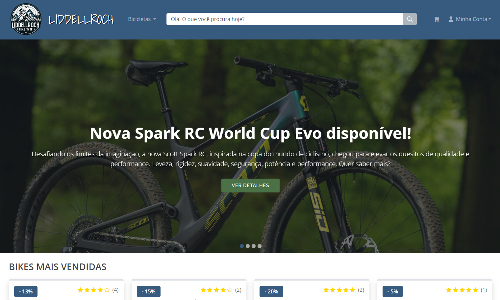
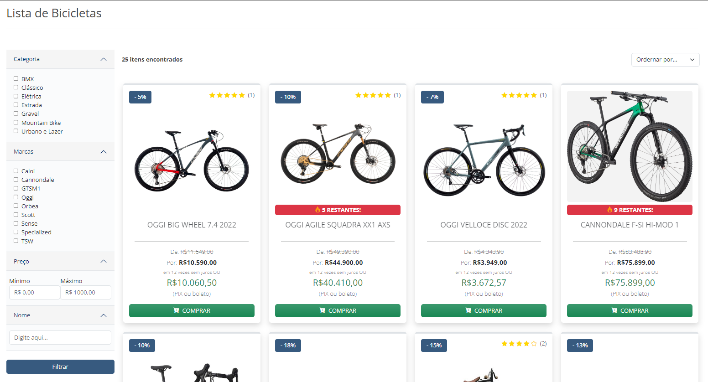
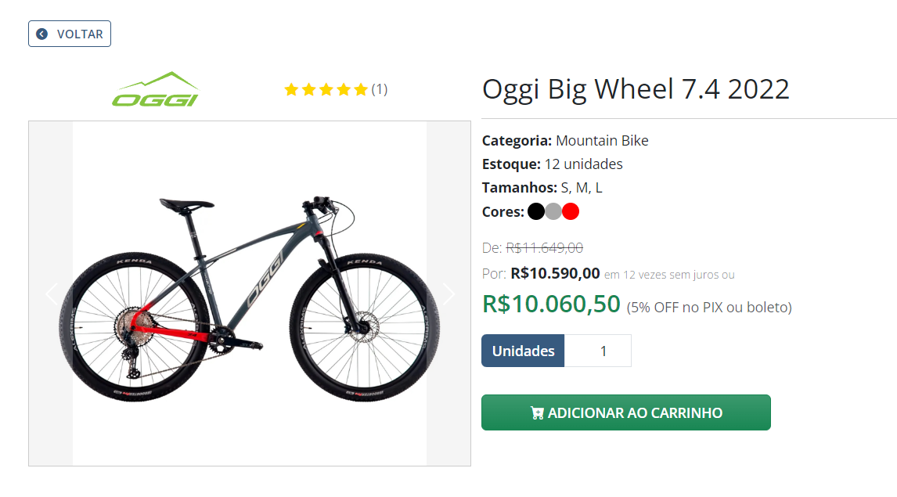
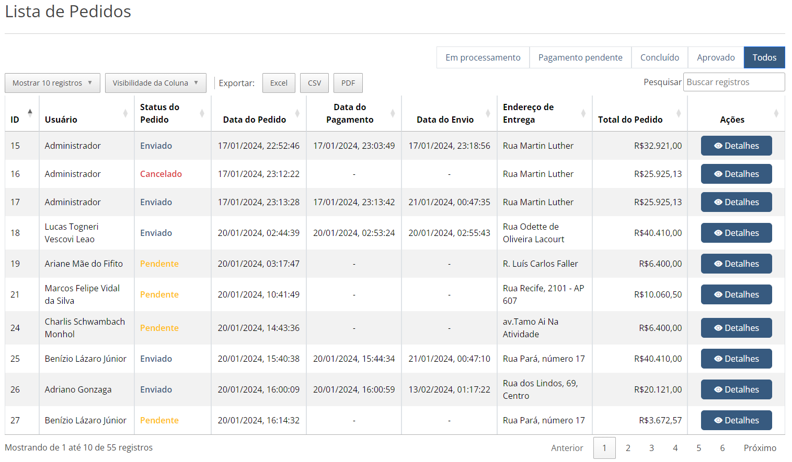
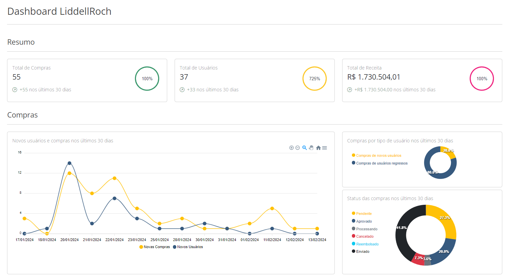

<h1 align="center"> LiddellRoch - BikeShop</h1>

<p align="center">
  
</p>
<p align="center">Fonte: Criado pelo autor</p>

## 📑 Sumário
- [Contexto](#-contexto)
- [Projeto](#-projeto)
- [Diagrama de Classes](#-diagrama-de-classes)
- [Tecnologias](#-tecnologias)
- [Ferramentas](#-ferramentas)
- [Como Executar](#-como-executar)
- [Navegando pelo Website](#-navegando-pelo-website)
- [Screenshots](#screenshots)
- [Licença](#memo-licence)

## 🌐 Contexto
Este repositório foi desenvolvido como projeto final para a conclusão da pós-graduação em Desenvolvimento Web Fullstack, pela PUC Minas. O projeto consiste uma loja virtual de bicicletas que busca simplificar o processo de busca, navegação e aquisição de bicicletas de diversas marcas reconhecidas nacional e internacionalmente, ponderando a acessibilidade e diferentes tipos de perfis de clientes que buscam por um produto, como a idade e familiaridade com transações de pagamentos em ambientes virtuais. O relatório final do projeto está disponibilizado clicando [aqui](https://drive.google.com/file/d/1ANjSlGYu55pHYcD8Nw04et_FsIjQ4cRz/view?usp=sharing), bem como a [apresentação](https://www.youtube.com/watch?v=ERo4aTyYFbI&ab_channel=LucasKlitzke).

## 💻 Projeto
Este projeto foi desenvolvido em .NET 7 utilizando a arquitetura MVC (Model-View-Controller), padrão Repositório e Clean Architecture. A estrutura é organizada em camadas bem definidas, permitindo um CRUD (Create, Read, Update, Delete) eficiente e limpo para a manipulação de dados em um banco de dados SQL Server através do ORM (Object Relational Mapping) Entity Framework Core. A autenticação e gerenciamento de usuários são realizados utilizando o Identity nativo do .NET Core. O projeto inclui pipelines de CI/CD via GitHub Actions, simulação de transações utilizando a API do Stripe, e hospedagem da aplicação e banco de dados no Azure. Além disso, diversos pacotes auxiliares foram implementados para otimizar a manipulação de dados.

## 📐 Diagrama de Classes
<p align="center">
  
</p>
<p align="center">Fonte: Criado pelo autor</p>

## ⚙️ Tecnologias
- .NET 7
- Entity Framework Core
- Identity
- AutoMapper
- SQL Server
- Stripe
- GitHubActions
- Azure

## 🛠️ Ferramentas
- Microsoft Visual Studio 22
- Fork
- SQL Server Management Studio 22

## ✅ Como Executar
É necessário que você possua um banco de dados SQL Server acessível e configurado no appsettings.json. A definição padrão é a que segue:
```
"ConnectionStrings": {
  "DefaultConnection": "Server=.;Database=LiddellRoch;Trusted_Connection=True;TrustServerCertificate=True",
  "ApplicationDbContextConnection": "Server=(localdb)\\mssqllocaldb;Database=LiddellRoch.Web;Trusted_Connection=True;MultipleActiveResultSets=true"
}
```

Ao inicializar a aplicação pela primeira vez, a migration inicial de criação de dados será executado, tal qual segue no DbInitializer.cs:
```
try
{
    if (_db.Database.GetPendingMigrations().Count() > 0)
    {
        _db.Database.Migrate();
    }
}
```
De forma alternativa, é possível criar o banco executando o seguinte comando no Package Manager Console:
```
Update-Database
```

Por fim, simplesmente execute o projeto pelo Visual Studio ou pelo sersimply run the project (pay attention to what folder you're in!):
```
dotnet run --project ./LiddellRoch.Web/LiddellRoch.Web.csproj
```

## 🛒 Navegando pelo Website
O website permite que você navegue livremente entre o catálogo de bicicleta, porém requer login para adicionar itens ao carrinho de compras e processar transações. Para utilizar o login de administrador, utilize as credencias:
- E-mail: Administrador@gmail.com
- Senha: Admin123*

As demais credenciais podem ser visualizadas e manipuladas no arquivo DbInitializer.cs.

## Screenshots
<p align="center">
  
</p>
<p align="center">Tela inicial. Fonte: Criado pelo autor</p>

<p align="center">
  
</p>
<p align="center">Catálogo de bicicletas. Fonte: Criado pelo autor</p>
<p align="center">
  
</p>
<p align="center">Detalhes de uma bicicleta. Fonte: Criado pelo autor</p>

<p align="center">
  
</p>
<p align="center">Listagem de pedidos. Fonte: Criado pelo autor</p>
<p align="center">
  
</p>
<p align="center">Dashboards. Fonte: Criado pelo autor</p>


## :memo: Licence
This project is under MIT License.